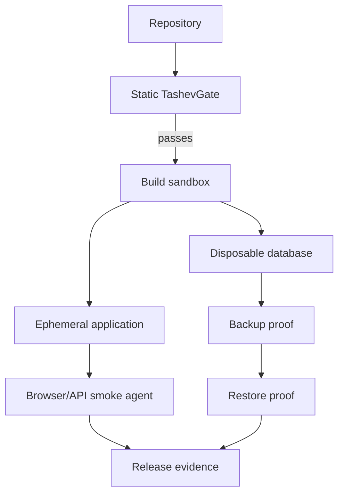

# Architecture

TashevGate v0.1 is a deterministic local release gate.

## Pipeline

1. **Collect** text/config/source files while respecting configured excludes and size limits.
2. **Detect** languages, frameworks, manifests, tests, CI, Docker and migrations.
3. **Run rules** across security, secrets, migrations, readiness and runtime configuration.
4. **Apply policy**: disabled rules, severity overrides and gate threshold.
5. **Decide** READY or BLOCKED.
6. **Render evidence** to console, Markdown, JSON or SARIF.

The scanner never needs network access to inspect a repository.

## Rule contract

A finding contains:

- stable rule ID;
- title;
- severity;
- evidence description;
- path and optional line;
- remediation;
- auto-fixable flag;
- metadata.

Sensitive matching values should never be copied to reports when a redacted representation is sufficient.

## Release philosophy

TashevGate deliberately separates:

- **evidence collection** — what was actually detected;
- **severity** — how serious that evidence is;
- **policy** — what the current team chooses to block.

This prevents a configurable warning from being mistaken for a factual guarantee.

## Future staging runner

The planned execution layer will add isolated ephemeral environments:

Production mutation will remain a separate, explicit capability with auditable approval and rollback boundaries.
