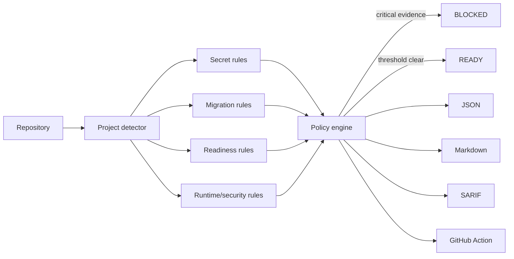

# VibeGate

> **AI can write the app. VibeGate checks whether you should dare to ship it.**

**VibeGate** is an open-source production readiness gate for AI-built and vibe-coded software. It scans the whole project for high-impact release risks and returns a deliberately simple decision:

**READY** or **BLOCKED**.

It is not another style linter and it does not invent a vanity score. A release is blocked only when configured evidence reaches the gate threshold.

## What it catches

VibeGate v0.1 includes rules for:

- committed OpenAI-compatible, GitHub, AWS, Stripe and Telegram secrets;
- private keys and real `.env` files;
- secret-looking values exposed through `NEXT_PUBLIC_`, `VITE_` or `REACT_APP_`;
- destructive SQL migrations;
- missing `.gitignore` protection;
- missing dependency lock files;
- missing tests and CI;
- migrations without documented **backup + rollback**;
- production debug mode;
- wildcard CORS;
- admin-looking routes without obvious authorization markers.

## 60-second start

```bash
git clone https://github.com/tashev11/vibegate.git
cd vibegate

python3 -m venv .venv
source .venv/bin/activate
pip install -e .

vibegate check /path/to/your/project
```

Typical result:

```text
VibeGate · BLOCKED
Scanned 184 files · gate threshold: blocker

⛔ BLOCKER ENV001 · .env
   Environment file is inside the project

⛔ BLOCKER MIG001 · migrations/042_cleanup.sql:8
   Destructive database migration

🔴 HIGH RECOVERY001
   Database changes lack documented backup + rollback
```

Exit code is non-zero when the gate is blocked, so VibeGate can stop a deployment.

## Add it to an existing project

```bash
cd your-project
vibegate init
vibegate check .
```

`vibegate init` safely creates:

- `.vibegate.yml`;
- `.github/workflows/vibegate.yml`;
- missing secret-related `.gitignore` entries.

It never overwrites an existing VibeGate config or workflow.

## Safe fixes

```bash
vibegate fix .
```

The safe fixer currently:

- protects `.env`, private keys and VibeGate reports in `.gitignore`;
- can build `.env.example` from variable **names only**;
- never copies secret values into the example file.

VibeGate intentionally does not auto-rewrite auth, database or security logic in v0.1.

## GitHub Action

After `vibegate init`, every pull request can run the gate.

Or add it manually:

```yaml
- uses: actions/checkout@v4
- uses: tashev11/vibegate@v0.1.0
  with:
    path: "."
    fail-on: "blocker"
```

The action also writes a SARIF report to `.vibegate/vibegate.sarif`.

## CLI

```bash
vibegate check .                         # human console report
vibegate check . --format markdown       # audit/report document
vibegate check . --format json           # machine-readable result
vibegate check . --format sarif          # GitHub/code-scanning format
vibegate check . --fail-on high          # stricter release policy
vibegate init .                           # config + GitHub workflow
vibegate fix .                            # deterministic safe fixes
vibegate explain MIG001                  # explain one rule
vibegate doctor                           # local environment
```

Exit codes:

| Code | Meaning |
|---:|---|
| 0 | READY |
| 2 | BLOCKED |
| 3 | invalid project/config invocation |

## Policy

The default gate blocks only **BLOCKER** findings. Teams can make HIGH or MEDIUM findings blocking:

```yaml
gate:
  fail_on: high
```

Rules can be disabled or severity-adjusted explicitly:

```yaml
rules:
  disabled:
    - AUTH001

  severity_overrides:
    TEST001: high

  allow_destructive_migrations: false
```

See [RULES.md](RULES.md).

## Reports

VibeGate supports:

- human console output;
- Markdown;
- JSON;
- SARIF 2.1.0.

Example:

```bash
mkdir -p .vibegate
vibegate check . --format markdown --output .vibegate/report.md
vibegate check . --format sarif --output .vibegate/vibegate.sarif
```

## Architecture



The core is intentionally local and deterministic. No source code has to be uploaded to a VibeGate cloud service.

More: [ARCHITECTURE.md](ARCHITECTURE.md).

## Why another tool?

Code review, SAST, error monitoring and CI each solve useful pieces of the problem. VibeGate focuses on the release boundary:

> **Can this AI-built project move toward production without an obvious release blocker?**

The roadmap extends this from static evidence to real staging validation: build, temporary deployment, auth flows, database backup/rollback, browser smoke tests, performance and recovery.

## Roadmap

Near-term work:

- packet-level dependency and supply-chain checks;
- framework-aware auth rules;
- Docker/IaC production rules;
- staging sandbox runner;
- browser E2E smoke agents;
- database backup/restore proof;
- deploy + health check + automatic rollback;
- reusable “Vibe Certificate” evidence for open-source projects.

See [ROADMAP.md](ROADMAP.md).

## Русская документация

[docs/README_RU.md](docs/README_RU.md)

## Security

VibeGate itself may scan secrets, but reports deliberately redact detected secret values. Read [SECURITY.md](SECURITY.md) before using SARIF or other reports in public repositories.

## Contributing

See [CONTRIBUTING.md](CONTRIBUTING.md).

## License

MIT © Rinat Tashev
