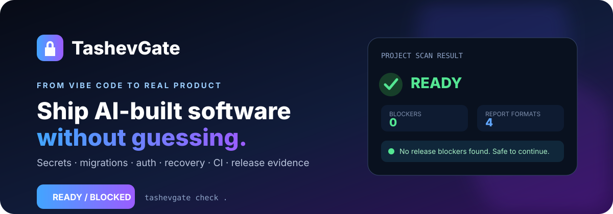
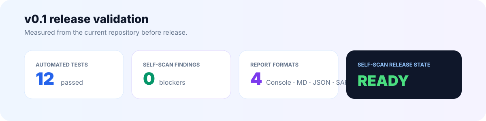
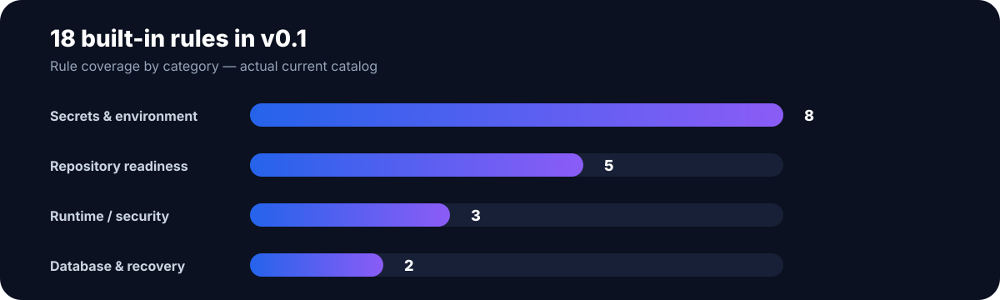
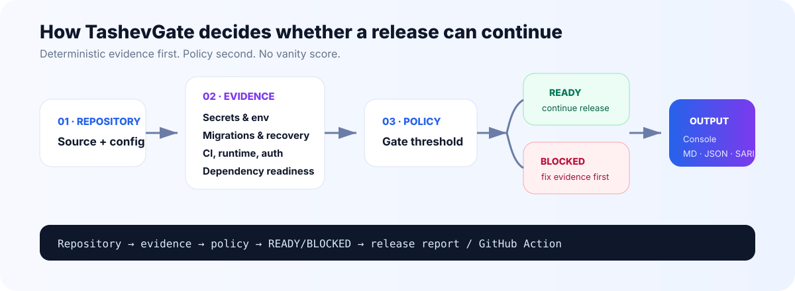
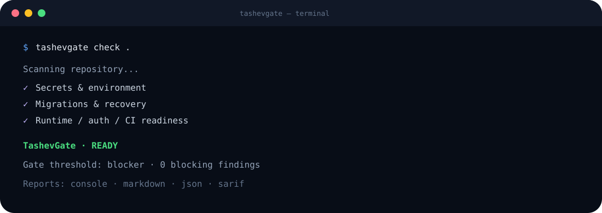

<p align="center">
  
</p>

<p align="center">
  <a href="https://github.com/tashev11/tashevgate/releases/tag/v0.1.0"></a>
  
  
  
</p>

<p align="center">
  <strong>AI can write the app. TashevGate checks whether you should dare to ship it.</strong>
</p>

<p align="center">
  <a href="#-60-second-start">Quick start</a> ·
  <a href="#-what-tashevgate-checks">Rules</a> ·
  <a href="#-github-action">GitHub Action</a> ·
  <a href="docs/README_RU.md">Русская документация</a> ·
  <a href="ROADMAP.md">Roadmap</a>
</p>

---

## 🛡 What TashevGate is

**TashevGate** is an open-source production-readiness gate for AI-built and vibe-coded software.

It scans the project for high-impact release risks and returns a deliberately simple decision:

<table>
<tr>
<td width="50%" align="center">

### 🟢 READY
No configured release blocker was found.

</td>
<td width="50%" align="center">

### 🔴 BLOCKED
Fix the evidence before the release continues.

</td>
</tr>
</table>

There is no vanity score. **Detection and release policy are separate**: TashevGate finds evidence, then your configured threshold decides whether the release can continue.

<p align="center">
  
</p>

> Release-validation numbers above describe the current **v0.1 repository**: 12 automated tests passed, the self-scan returned READY with 0 findings, and four report formats are supported.

---

## 🔍 What TashevGate checks

The current catalog contains **18 built-in rules**.

<p align="center">
  
</p>

| Area | Examples |
|---|---|
| 🔐 **Secrets & environment** | OpenAI-compatible keys, GitHub tokens, AWS keys, Stripe live secrets, Telegram bot tokens, private keys, real `.env`, frontend-exposed secret names |
| 🗄️ **Database & recovery** | Destructive SQL migrations, missing documented backup + rollback |
| 📦 **Repository readiness** | Missing `.gitignore`, lock files, tests, CI |
| ⚙️ **Runtime & security** | Debug mode, wildcard CORS, suspicious admin routes without obvious authorization markers |

Full catalog: [RULES.md](RULES.md).

---

## 🧠 How the decision works

<p align="center">
  
</p>

The scanner is **local-first and deterministic**. Source code does not need to be uploaded to a TashevGate cloud service.

1. Collect project evidence.
2. Detect languages, frameworks, manifests, tests, CI and migrations.
3. Run built-in rules.
4. Apply your policy threshold.
5. Return **READY** or **BLOCKED**.
6. Emit Console, Markdown, JSON or SARIF evidence.

More details: [ARCHITECTURE.md](ARCHITECTURE.md).

---

## ⚡ 60-second start

```bash
git clone https://github.com/tashev11/tashevgate.git
cd tashevgate

python3 -m venv .venv
source .venv/bin/activate
pip install -e .

tashevgate check /path/to/your/project
```

<p align="center">
  
</p>

Exit codes are automation-friendly:

| Code | Meaning |
|---:|---|
| **0** | READY |
| **2** | BLOCKED |
| **3** | invalid project/config invocation |

---

## 🧩 Add TashevGate to an existing project

```bash
cd your-project
tashevgate init
tashevgate check .
```

`tashevgate init` safely creates:

- `.tashevgate.yml`;
- `.github/workflows/tashevgate.yml`;
- missing secret-related `.gitignore` entries.

It never overwrites an existing TashevGate config or workflow.

---

## 🛠 Safe fixes

```bash
tashevgate fix .
```

The safe fixer currently:

- protects `.env`, private keys and TashevGate reports in `.gitignore`;
- can create `.env.example` from variable **names only**;
- never copies original secret values.

TashevGate deliberately does **not** silently rewrite authentication, payments, database logic or production infrastructure in v0.1.

---

## 🤖 GitHub Action

After `tashevgate init`, every pull request can run the gate.

Or add it manually:

```yaml
- uses: actions/checkout@v4

- uses: tashev11/tashevgate@v0.1.0
  with:
    path: "."
    fail-on: "blocker"
```

The action writes SARIF evidence to:

```text
.tashevgate/tashevgate.sarif
```

That means TashevGate can act as a real pre-release gate in CI instead of being only a report generator.

---

## 🖥 CLI

```bash
tashevgate check .                         # human console report
tashevgate check . --format markdown       # audit document
tashevgate check . --format json           # machine-readable result
tashevgate check . --format sarif          # GitHub/code-scanning format
tashevgate check . --fail-on high          # stricter release policy
tashevgate init .                           # config + GitHub workflow
tashevgate fix .                            # deterministic safe fixes
tashevgate explain MIG001                  # explain one rule
tashevgate doctor                           # local environment
```

---

## 🎛 Policy

Default:

```yaml
gate:
  fail_on: blocker
```

Make HIGH findings blocking:

```yaml
gate:
  fail_on: high
```

Override explicit rules:

```yaml
rules:
  disabled:
    - AUTH001

  severity_overrides:
    TEST001: high

  allow_destructive_migrations: false
```

Prefer narrow exceptions over disabling the gate.

---

## 📄 Reports

TashevGate supports four output formats:

| Format | Best for |
|---|---|
| **Console** | humans and local development |
| **Markdown** | audit/release documents |
| **JSON** | automation and agents |
| **SARIF 2.1.0** | GitHub/code-scanning ecosystems |

```bash
mkdir -p .tashevgate

tashevgate check . \
  --format markdown \
  --output .tashevgate/report.md

tashevgate check . \
  --format sarif \
  --output .tashevgate/tashevgate.sarif
```

---

## 🚀 Where TashevGate is going

The static gate is only the first layer.

```text
Repository
   ↓
Static evidence gate          ← v0.1
   ↓
Ephemeral build sandbox       ← planned
   ↓
Disposable database
   ↓
Auth / API / browser smoke tests
   ↓
Backup → migration → restore proof
   ↓
Release evidence
   ↓
Deploy → health check → rollback
```

Near-term roadmap:

- framework-aware Next.js / FastAPI / Supabase auth checks;
- Docker and IaC production rules;
- dependency and supply-chain evidence;
- pull-request baseline/diff mode;
- staging sandbox runner;
- browser E2E smoke agents;
- database backup/restore proof;
- deploy + health check + automatic rollback;
- **Vibe Certificate**: verifiable release evidence for GitHub projects.

See [ROADMAP.md](ROADMAP.md) and the open [GitHub Issues](https://github.com/tashev11/tashevgate/issues).

---

## 🔒 Security model

TashevGate itself may scan secrets, but ordinary reports redact matched secret values.

A clean scan is **evidence that configured checks passed**, not a mathematical proof that an application is secure.

Read [SECURITY.md](SECURITY.md) before publishing reports from private or sensitive projects.

---

## 🤝 Contributing

Contributions are welcome, especially for:

- framework adapters;
- high-confidence security rules;
- migration safety;
- Docker/IaC checks;
- staging sandboxing;
- release evidence.

See [CONTRIBUTING.md](CONTRIBUTING.md).

---

## 📚 Documentation

- [Architecture](ARCHITECTURE.md)
- [Built-in rules](RULES.md)
- [Roadmap](ROADMAP.md)
- [Security](SECURITY.md)
- [Contributing](CONTRIBUTING.md)
- [Русская документация](docs/README_RU.md)
- [Changelog](CHANGELOG.md)

---

<p align="center">
  <strong>TashevGate</strong><br>
  From vibe code to release evidence.
</p>

<p align="center">
  MIT © Rinat Tashev
</p>
